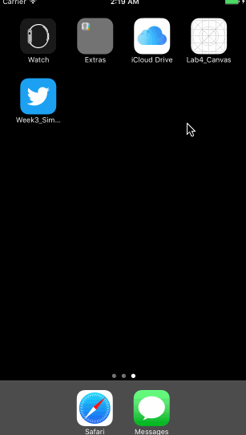

# Lab4_Canvas

Canvas is an app using views, gesture recognizers, and animations to build a tray of smiley faces that can be dragged onto a canvas.

Time spent: 5 hours spent in total

## User Stories

The following **required** functionality is completed:

- [x] User can Open + Close the Tray of faces
- [x] User can Creating New Faces
- [x] User can Panning Faces
- [x] User can Scaling Faces

The following **additional** features are implemented:

## Video Walkthrough

Here's a walkthrough of implemented user stories:

GIF created with [LiceCap](http://www.cockos.com/licecap/).
